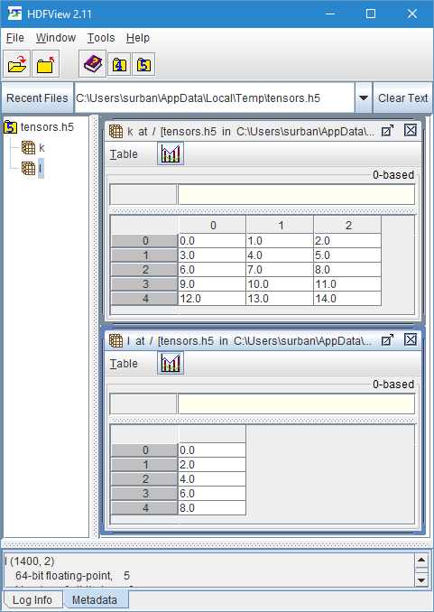

# Save and load

The primary data storage format is HDF5.
For compatibility, Numpy files can also be read.

## Disk storage in HDF5 format

Tensors can be stored in and read from industry-standard [HDF5 files](https://en.wikipedia.org/wiki/Hierarchical_Data_Format).
Multiple tensors can be stored in a single HDF5 file and accessed by assigning names to them.

An opened HDF5 file is represented by an [HDF5 object](xref:Tensor.HDF5).
To close the file, dispose this object.

### Writing tensors to disk
Use the [HostTensor.write](xref:Tensor.HostTensor.write*) function to write a tensor to an HDF5 file opened for writing.

The following code creates two tensors `k` and `l` and writes them into the HDF5 file `tensors.h5` in the current directory.

```fsharp
let k = HostTensor.init [5L; 3L] (fun [|i; j|] -> 3.0 * float i + float j)
let l = HostTensor.init [5L] (fun [|i|] -> 2.0 * float i)
use hdfFile = HDF5.OpenWrite "tensors.h5"
HostTensor.write hdfFile "k" k
HostTensor.write hdfFile "l" l
```

Tensor must be stored in host memory, before they can be written to disk.

### Loading tensors from disk
Use the [HostTensor.read](xref:Tensor.HostTensor.read*) function to read a tensor from an HDF5 file opened for reading.

The following code loads the tensors `k` and `l` from the previously created HDF5 file `tensors.h5` and stores them in the variables `k2` and `l2`.

```fsharp
use hdfFile2 = HDF5.OpenRead "tensors.h5"
let k2 = HostTensor.read<float> hdfFile2 "k"
let l2 = HostTensor.read<float> hdfFile2 "l"
```

The data types of `k2` and `l2` must be specified explicitly, since they must be known at compile-time.
If the declared data type does not match the data type encountered in the HDF5 file, an exception will be raised.
If the data type is unknown at compile time, you can use the [HostTensor.readUntyped](xref:Tensor.HostTensor.readUntyped*) function instead.

## Viewing and working with HDF5 files

The resulting file can be viewed using any HDF5 viewer, for example using the free, cross-platform [HDFView](https://www.hdfgroup.org/products/java/hdfview/) application as shown below.
Many useful tools for working with HDF5 file are provided at <https://support.hdfgroup.org/products/hdf5_tools/toolsbycat.html>.




## Reading .npy and .npz files produced by Numpy

For compatibility, it is possible to read `.npy` and `.npz` files produced by Numpy.
Not all features of the format are supported.
Writing `.npy` and `.npz` files is not possible and the HDF5 format should be instead.

Use the [NPYFile.load](xref:Tensor.Algorithm.NPYFile.load*) function to read an `.npy` file and return its contents as a tensor.

Use the [NPZFile.Open](xref:Tensor.Algorithm.NPZFile.Open*) function to open an `.npz` file and the [Get](xref:Tensor.Algorithm.NPZFile.Get*) method of the resulting object to obtain individual entries as tensors.
